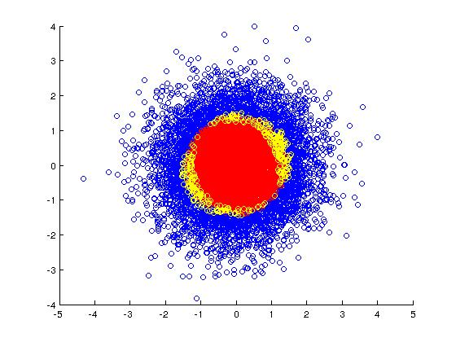
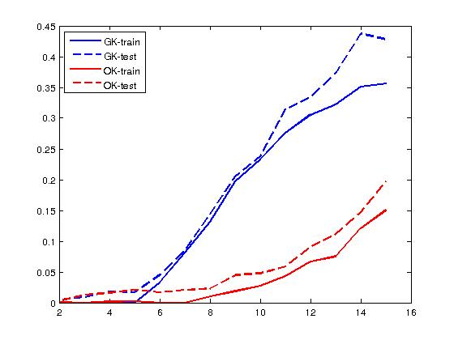

# LearningKernelsWithRandomFeatures
Experiments code is not released. I conducted the experiments based on Aman Sinha's paper "Learning Kernels with RandomFeatures"(NIPS2016)

The two figures are the results of experiment for Sec4.1 in paper.

The figure above describes the optimized random features(yellow) seperate synthetized data:positive datapoints(blue) and negative(red).

The figure above describes misclassification error of logistic regression model vs. dimensionality of data. GK denotes random features with a Gaussian kernel, and our optimized kernel is denoted OK.

Any question is welcome. Please feel free to contact me via email or WeChat. Email: zhaojiayi11@nudt.edu.cn   WeChat ID: kluo603548
